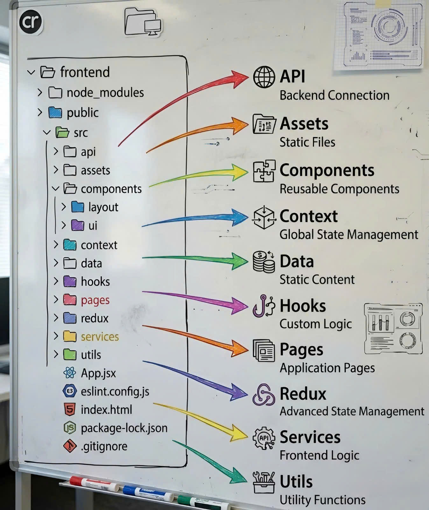

# React Enterprise Boilerplate

A scalable and well-structured React + TypeScript project architecture
designed for enterprise-level applications.

------------------------------------------------------------------------

## 📁 Project Structure



    react-enterprise-boilerplate/
    │
    ├── public/                 # Static assets (favicon, static images, etc.)
    │
    ├── src/
    │   ├── assets/             # Images, fonts, icons, global styles
    │   ├── components/         # Reusable UI components (Button, Modal, Input...)
    │   ├── constant/           # Application-wide constants and enums
    │   ├── features/           # Business logic modules (feature-based structure)
    │   ├── hooks/              # Custom React hooks
    │   ├── layouts/            # Layout components (MainLayout, AuthLayout...)
    │   ├── pages/              # Page-level components mapped to routes
    │   ├── routes/             # Application routing configuration
    │   ├── store/              # Global state management (Redux/Zustand/etc.)
    │   │
    │   ├── App.tsx             # Root application component
    │   ├── App.css             # App-level styles
    │   ├── index.css           # Global styles
    │   ├── main.tsx            # Application entry point
    │   └── vite-env.d.ts       # Vite TypeScript definitions
    │
    ├── index.html              # Root HTML template
    ├── package.json            # Project dependencies and scripts
    ├── package-lock.json       # Dependency lock file
    ├── tsconfig.json           # TypeScript configuration
    ├── tsconfig.node.json      # Node-specific TypeScript configuration
    ├── vite.config.ts          # Vite configuration
    └── README.md               # Project documentation

------------------------------------------------------------------------

## 🧠 Architectural Principles

### 1️⃣ Separation of Concerns

Each folder has a clear responsibility: - UI components →
`components/` - Business logic → `features/` - Layout structure →
`layouts/` - Routing → `routes/` - Global state → `store/`

This ensures maintainability and scalability.

------------------------------------------------------------------------

### 2️⃣ Feature-Based Structure

Business logic is grouped by feature inside the `features/` directory.\
Each feature can contain: - components - services - hooks - slices (if
using Redux) - types - utils

Example:

    features/
    └── auth/
        ├── components/
        ├── services/
        ├── hooks/
        ├── auth.slice.ts
        └── types.ts

------------------------------------------------------------------------

### 3️⃣ Reusability & Composability

Shared UI components are placed inside `components/` to maximize reuse
across features.

------------------------------------------------------------------------

### 4️⃣ Scalable State Management

Global state is managed inside `store/`, allowing: - Centralized state
handling - Predictable data flow - Easy debugging

------------------------------------------------------------------------

## 🚀 Getting Started

### Install dependencies

``` bash
npm install
```

### Run development server

``` bash
npm run dev
```

### Build for production

``` bash
npm run build
```

------------------------------------------------------------------------

## 📦 Tech Stack

-   React
-   TypeScript
-   Vite
-   Modern State Management (Redux/Zustand)
-   Modular Architecture

------------------------------------------------------------------------

## 📌 Best Practices

-   Keep components small and reusable
-   Avoid business logic inside UI components
-   Organize code by feature when possible
-   Use TypeScript types consistently
-   Follow consistent naming conventions

------------------------------------------------------------------------

## 👨‍💻 Author

Code Web Không Khó

---
## 📚 Dạy Học Online

Bên cạnh tài liệu miễn phí, mình còn mở các khóa học online:

- **Lập trình web cơ bản → nâng cao**
- **Ứng dụng về AI và Automation**
- **Kỹ năng phỏng vấn & xây CV IT**

### Thông Tin Đăng Ký

- 🌐 Website: [https://codewebkhongkho.com](https://codewebkhongkho.com/portfolios)
- 📧 Email: nguyentientai10@gmail.com
- 📞 Zalo/Hotline: 0798805741

---

## 💖 Donate Ủng Hộ

Nếu bạn thấy các source hữu ích và muốn mình tiếp tục phát triển nội dung miễn phí, hãy ủng hộ mình bằng cách donate.  
Mình sẽ sử dụng kinh phí cho:

- 🌐 Server, domain, hosting
- 🛠️ Công cụ bản quyền (IDE, plugin…)
- 🎓 Học bổng, quà tặng cho cộng đồng

### QR Code Ngân Hàng

Quét QR để ủng hộ nhanh:


**QR Code ABBank**  
- Chủ tài khoản: Nguyễn Tiến Tài  
- Ngân hàng: NGAN HANG TMCP AN BINH  
- Số tài khoản: 1651002972052

---

## 📞 Liên Hệ

- 📚 Facebook Dạy Học: [Code Web Không Khó](https://www.facebook.com/codewebkhongkho)
- 📚 Tiktok Dạy Học: [@code.web.khng.kh](https://www.tiktok.com/@code.web.khng.kh)
- 💻 GitHub: [fdhhhdjd](https://github.com/fdhhhdjd)
- 📧 Email: [nguyentientai10@gmail.com](mailto:nguyentientai10@gmail.com)

Cảm ơn bạn đã quan tâm & chúc bạn học tập hiệu quả! Have a nice day <3!!
